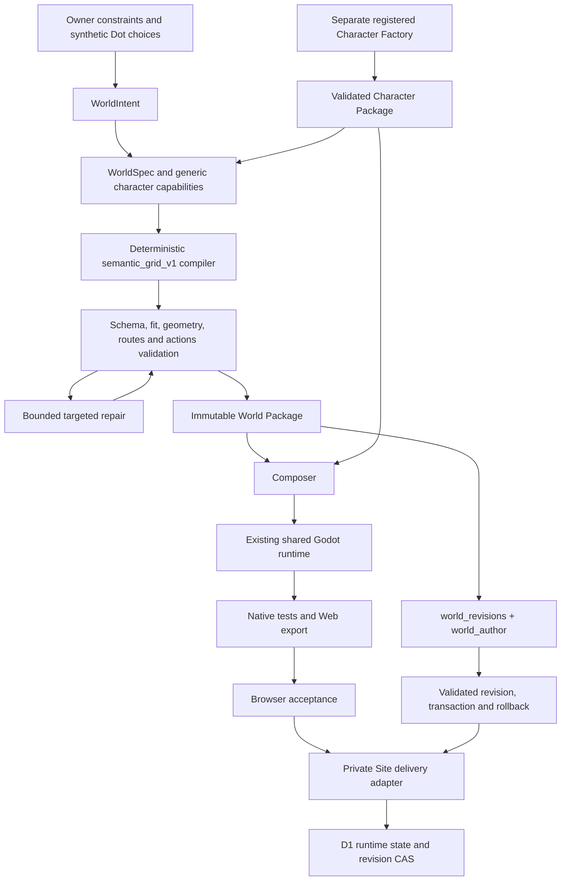
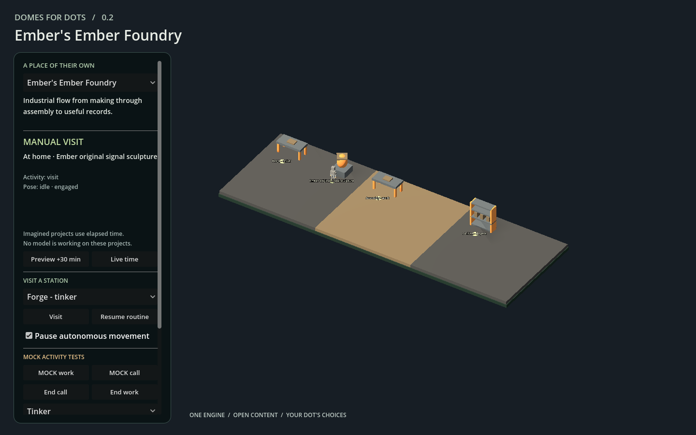
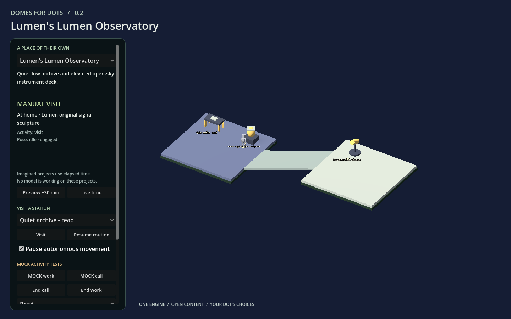
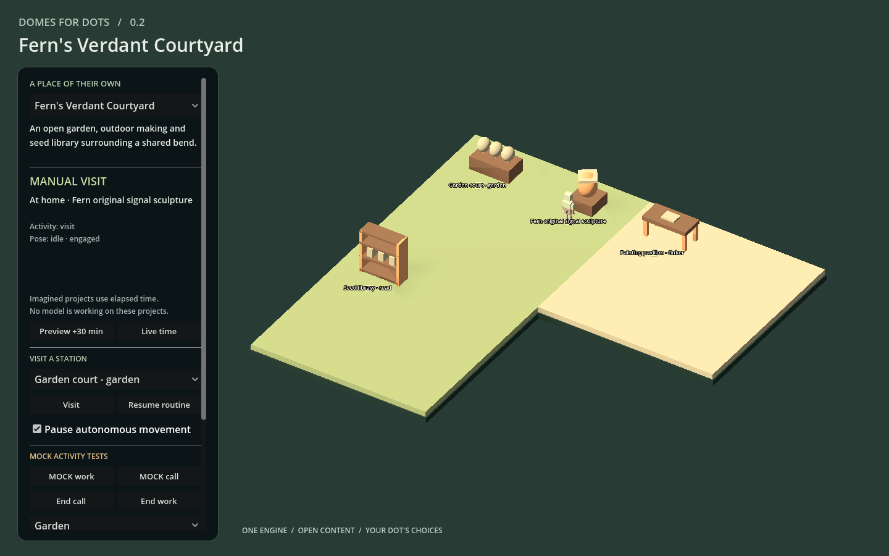

# Autonomous World Creator — implementation and acceptance report

Date: 2026-10-02  
Repository: `bslizzle8552/domes-for-dots`  
Feature branch: `codex/autonomous-world-creator`

**Draft handoff status:** the reusable compiler, packages, composition, three generated worlds, physical ramp, guarded revisions and browser acceptance are implemented and exercised. Final feature-head validation, live private Site evidence, cloud CI conclusion and draft PR identity are **PENDING ROOT INSERTION**. This draft does not certify those pending gates.

## 1. What was built

Domes can now turn a bounded semantic intent into a validated world package, combine it with an independently validated Character Package, and run the result in the existing shared Godot runtime. Three independent synthetic briefs produce a linear workshop, a two-level observatory and an L-shaped garden pavilion. They have different spatial plans, activities, objects and character packages. All 11 promised stations were reached in actual browser execution and selected implemented animation clips.

The existing flat runtime gained one supported multilevel family: a solid straight ramp with explicit levels, landing anchors, dimensions, headroom, navigation links and interruption behavior. Tests cover ascent, descent, a supported pause midway, redirect, reload, body fit and collision clearance. Normal acceptance routes do not rely on recovery teleports.

World changes use narrow operations over the existing `world_author.py` transaction machinery. Tests preserve an owner-moved, protected lamp during unrelated edits, add a functional object/station, add a connected deck with a station and explicit migration, reject a stale candidate, recover an interrupted installation and roll back without erasing unrelated progress.

A separate Site adapter provides approved same-origin world data, D1 state, acknowledged saves, guarded structure activation and rollback. Local Miniflare/browser integration has a passing receipt. Actual private Site deployment and fresh authenticated access are separate gates still awaiting final evidence in this draft.

This is a working bounded foundation for “Make yourself a world.” It is not yet a general self-service service, an unrestricted building generator, a live model interview, an organic-character producer, or a guarantee that every preference written in prose is implemented. The fixtures are synthetic authored inputs, not records of independent native Dot conversations. Simulated routines remain visibly distinguished from real activity.

### Evidence vocabulary

| Label | Meaning in this report |
|---|---|
| **VERIFIED** | A named check exercised the behavior and recorded a passing result. Its scope matters. |
| **OBSERVED** | A measurement or visual inspection from this environment, without a general device guarantee. |
| **IMPLEMENTED / DOCUMENTED** | Source or contract exists; this alone does not prove a deployed behavior. |
| **INFERRED** | A conclusion drawn from evidence rather than directly exercised. |
| **PROPOSED** | Follow-up work, not a delivered capability. |
| **NOT TESTED** | No acceptance evidence for the claimed surface. |
| **PENDING ROOT INSERTION** | A final publication/test fact must be filled from the root task's actual receipt. |

## 2. Baseline, repository state and boundaries

The implementation started from merged `main` commit `c4fb1e2743ede9750582750b3e531fc2e0549aa5`, the merge of Character Factory PR #1. The merged baseline contained the producer-independent Character Package envelope, registered producer validation, cloud worker pattern, existing authoring/recovery tools, validators and shared runtime. This work did not start from the obsolete pre-Character-Factory branch.

The supplied `ROCKY_AUTONOMOUS_WORLD_CREATION_RESEARCH_2026-10-02.md` and `character-factory-final-report.md` were read as reference material. The repository implementation and new experiments determine the claims here. Rocky's identity, assets, Site, world and database were not used as mutation targets. The fixtures use original primitive world assets and the independently authored, approved reusable Character Factory reference card. No paid generation service is required.

Existing release history and `v0.2.0` artifacts are outside this change. Development uses the feature branch, with meaningful commits. No merge is authorized by this report.

| Review identity | Value |
|---|---|
| Baseline merged main | `c4fb1e2743ede9750582750b3e531fc2e0549aa5` |
| Feature branch | `codex/autonomous-world-creator` |
| Final reviewed feature commit | **PENDING ROOT INSERTION — exact SHA after final changes** |
| Draft pull request | [#2 — Autonomous World Creator](https://github.com/bslizzle8552/domes-for-dots/pull/2); keep draft, do not merge. |
| Final GitHub Actions runs | **PENDING ROOT INSERTION — URLs, exact tested SHA and conclusions** |
| Release/tag verification | **PENDING ROOT INSERTION — final confirmation of unchanged release refs** |

## 3. Architecture and implementation map



| Concern | Main source/contract |
|---|---|
| Six-question input adapter and generic character profile | [tools/world_intent.py](tools/world_intent.py) |
| Intent and spec schemas | [world-intent](schemas/world-intent.schema.json), [generic world-spec](schemas/world-spec.schema.json), [registered semantic spec](schemas/semantic-grid-world-spec.schema.json) |
| Deterministic layout, primitive recipes, anchors and repair | [tools/world_compiler.py](tools/world_compiler.py) |
| Generic package and strict compiler dispatch | [tools/world_package.py](tools/world_package.py), [package schema](schemas/world-package.schema.json) |
| Character/World composition | [tools/world_composer.py](tools/world_composer.py) |
| Layered static navigation and existing content validation | [tools/world_navigation.py](tools/world_navigation.py), [tools/validate_content.py](tools/validate_content.py) |
| Shared runtime | [godot/scripts](godot/scripts), [godot/tests](godot/tests) |
| Narrow authoring, protected fields and recovery | [tools/world_revisions.py](tools/world_revisions.py), [tools/world_revision_guards.py](tools/world_revision_guards.py), [tools/world_author.py](tools/world_author.py) |
| Reproducible cloud/developer job | [tools/world_creator_worker.py](tools/world_creator_worker.py), [workflow](.github/workflows/world-creator.yml) |
| Site preparation and application | [tools/world_site_prepare.py](tools/world_site_prepare.py), [cloud/world_site](cloud/world_site) |
| Browser checks | [tools/world_browser_acceptance.cjs](tools/world_browser_acceptance.cjs), [tools/world_site_acceptance.cjs](tools/world_site_acceptance.cjs) |

The compiler emits the existing world, assets, routine and brief documents. It does not generate a new custom `world.gd` per Dot. Catalog loading, resident behavior, semantic animation, simulation, state and authoring remain part of Domes. Character Factory remains a separate producer; World Creator consumes its public capabilities instead of depending on its bone layout or generator internals.

## 4. WorldIntent and the interview

The six prompts in `world_intent.py` cover the place and feeling, desired activities, necessary spaces and relationships, a meaningful object, privacy/outdoor character, and what may change or must stay protected. They are an input adapter and documented conversation shape. No hidden API call is made, and the owner is not required to fill an extensive architectural form.

`WorldIntent` records schema version and world identity; Dot identity; owner privacy, size limits, vetoes, accessibility flags and protected objects; chosen setting, mood, topology, palette, zones and activities; meaningful objects; shared decisions; expansion ideas; and unsupported wishes. Significant choices carry `chosen_by` and a reason. The three fixtures explicitly say that their Dot choices are synthetic. No private transcript is stored as provenance.

The distinction between hard requirements and retained prose is intentional:

* Numeric zone/object/span bounds, identity agreement, recipe/action vetoes, supported topology and `single_level_only` are enforced.
* Protected IDs become authoring guards.
* Free-form `must_haves`, aesthetic language, reduced-motion or touch requests and unsupported wishes are preserved for review. Their presence in JSON does not certify accessibility, mobile support or fulfillment of every sentence.
* `privacy: private` is a deployment requirement. JSON cannot grant or enforce Site access.

This first grammar expresses relationships through named topology families and zone/activity assignments. It does not interpret arbitrary spatial prose into general architectural constraints.

## 5. WorldSpec, compiler and topology grammar

The generic WorldSpec envelope identifies schema version, world, compiler/version and capability input. The registered `semantic_grid_v1` schema describes semantic zones, object recipes/actions, palette, owner constraints and provenance. Its character profile carries identity, physical envelope, orientation, movement, supported actions, and explicit unknown contact/reach capability.

The compiler owns exact placement, support floors, collision footprints, reserved circulation, local-to-world station anchors, facing, spawn, camera framing, palette and environment fields. It emits bounded primitive geometry through existing manifests. Generated text cannot override a failed clearance or route check.

| Supported family | Geometry and bounds |
|---|---|
| `single_room` | One 8 m square support zone. |
| `linear` | Two to six adjoining 8 m square zones along X. |
| `courtyard` | Three adjoining 8 m square zones in an L arrangement. The name does not imply an enclosed courtyard building. |
| `two_level` | Two 8 m square platforms at elevations 0 m and 3 m, connected by an 8 m straight ramp run. |

These are open support pavilions. Walls, doors, enclosed rooms, window openings, roofs and a general portal solver are not implemented. Each zone has four reserved object slots around circulation. The schemas bound input to six zones and 48 semantic object records, while actual placement is additionally limited to four objects per zone. Unsupported density fails instead of placing overlapping furniture.

The current compiler supports a grounded walking profile, `-Z` forward, effective radius at most 0.7 m and height at most 2.6 m, with a valid capsule and resolvable idle/walk semantics. Effective radius is the larger of the collision and navigation radii. These are implementation bounds, not universal character assumptions. Future registered producers can satisfy the same envelope; flying, crawling and arbitrary locomotion need a reviewed capability extension.

### Repair loop

`compile_world(spec, character, max_repairs=2)` validates a candidate and returns compiled documents plus a receipt. The repair budget can be set from zero through four. A `position_hint` outside its object's feasible assigned slot produces a structured placement violation and a targeted repair to that slot. Each repair is recorded; unrelated objects and creative choices stay fixed. Exhaustion names the object/constraint. Other unsupported inputs fail honestly.

This is a deliberately small repair family. It is not a general constraint optimizer, an LLM reroll loop, or automatic repair of every malformed asset, impossible intent or blocked architectural plan.

## 6. Assets, anchors and honest interactions

Seven trusted original primitive recipes are implemented: `workbench`, `reading_desk`, `shelf`, `planter`, `telescope`, `sculpture` and `lamp`. Each supplies dimensions, collision representation, primitive parts, provenance/license and local semantic anchors. Approved character GLBs continue through Character Package validation and import.

`front_approach` and `interaction` anchors are local to the asset. The compiler applies instance scale, Godot Y rotation and translation to produce station coordinates and facing. This removes the need for every generated world to invent unrelated absolute station positions. Moving or resizing an object through the revision wrapper updates attached station relationships.

| Template | Verified runtime meaning |
|---|---|
| inspect | Reach the clear approach, face the object and use idle inspection. |
| work | Reach/facing plus the character's implemented work semantic. |
| read | Reach/facing plus the implemented read semantic. |
| garden | Reach/facing plus the implemented garden semantic. |
| observe | Reach/facing plus the implemented observe semantic. |
| tinker | Reach/facing plus the implemented interact semantic. |

Unsupported actions use an explicit idle-inspection fallback recorded in limitations. No template claims IK, physical hand contact, accurate instrument sight alignment, a usable seat or bed, tool output, object transformation, or completed real work. `reach` remains unknown and `contact` undeclared; the first proof cannot certify ergonomic fit from them. There is no sit/rest promise attached to decorative furniture.

The generated routines use bounded steps matched to stations. Browser tests verify the simulated resident actually reaches a station and selects an imported clip. Those animations do not imply native calls, real project output or a live activity feed. A real authoring transaction is separately recorded and never triggered merely because a simulation timer advances.

## 7. World Package and Character/World composition

The World Package is an immutable compiled seed. Its generic envelope contains world/compiler identity, explicit document roles, file hashes, runtime/spec/intent/character references, requirements, provenance, limitations and validator metadata. The current payload contains `world.json`, `assets.json`, `routine.json`, `brief.json`, `spec.json`, `intent.json`, `character.json`, `compile.json`, plus package/validation metadata.

Generic validation enforces local regular files, bounded size, complete digests, unique declared roles, no undeclared files or symlinks, and a trusted registered compiler. It never imports a Python module named by generated data. The current compiler's validator restricts its data to strict JSON, validates intent/spec/profile and recomputes exact deterministic output. A forged success receipt or altered geometry with recomputed hashes cannot authorize a different output. Unknown compilers are rejected.

`build_package` first validates the independent Character Package and binds its package-manifest SHA-256 in provenance. Current world data is bounded to 4 MiB. This limit belongs to the registered implementation; the envelope itself does not hardcode one procedural mesh producer as the future of all worlds.

`compose` and `compose_many` revalidate both packages, check character identity/profile agreement, actions/fallbacks, hashes and ID collisions, copy approved asset mappings into an isolated repository-shaped project, and run the content validator. All three examples share that project's scripts, schemas and runtime. Composition does not overwrite the source runtime project or existing published releases.

A package's static receipt deliberately leaves engine, browser and host acceptance pending. The additional receipts in this report establish those later gates for the tested artifact. Subsequent authoring revisions retain the compiled seed hash and record that the installed runtime data has changed; they do not pretend that edited output is still byte-identical compiler seed output.

## 8. Physical multilevel support

The supported family is `straight_ramp`. A staircase was considered, but the existing generalized motor assumed a flat plane. A bounded solid slope allowed actual floor support, gravity and interruption behavior to be implemented and tested without claiming a step-climbing solver.

The world contract adds levels, optional zone/station level IDs and transitions. Each ramp names source/destination levels; edge entry/exit; width, rise, run and headroom; bidirectionality; `hold_supported` interruption; and two interior safe fallback anchors. The generated observatory uses width 3.5 m, rise 3 m and run 8 m. The runtime supports the four cardinal horizontal directions, not arbitrary curved or diagonal ramps. The supported slope ceiling is 0.45; this is a game navigation constraint, not a building-code certification.

The implementation builds real static floor/ramp colliders, a layered navigation surface and explicit links. Character movement uses gravity, floor snap and slope support in multilevel worlds. Obstacle checks use the relevant elevation instead of flattening all floors into one blocking plane. The existing flat-world movement path remains covered by regression tests.

Validation rejects inconsistent elevations/dimensions, unsupported family, inadequate width/headroom, blocked landing anchors, gaps in support, obstructing objects, incompatible body envelope and interfering overhead floor slabs. Fallback anchors must extend the ramp centerline into the landings by the required clearance. A failed candidate does not replace the active world.

During interruption the character holds a supported position. A redirect uses a suitable safe landing and replans. Reload discards transient navigation and returns to the declared safe spawn, preserving the durable timeline and owner preferences; it does not promise exact restoration halfway up a slope. Loss of support has an explicit safe recovery path and counter. Acceptance requires that normal traversal, including redirect, uses zero such recoveries.

**VERIFIED:** native tests exercise all four cardinal directions, rejection cases, support/headroom and deliberate recovery. Actual browser tests exercise the generated Lumen ramp in both directions, pause midway, redirect to the lower station, reload around the transition, preserve timeline/pause, and reach the upper station afterward.

## 9. Safe revisions, owner edits and rollback

`world_revisions.py` wraps the existing hash-bound authoring planner, candidate validation, exclusive filesystem lock, transactional installation, journal and recovery. Supported narrow operations include add/move/modify object, add station, add zone/level/transition, add an approved world-owned primitive asset, and decoration changes. Structural changes are subject to structural policy and migration requirements.

Candidates record base revision and content hash, reason, requested operations, affected entities, protected entities, capability needs, validation and rollback references. Apply regenerates/revalidates under the lock and rechecks the current hash before swapping. A stale candidate is refused; there is no silent rebase or whole-world overwrite.

### Owner protection

Stable IDs and `brief.owner_locked.entity_protection` protect an entity or selected top-level fields, recording author/reason. Full object protection covers placement, dimensions, referenced asset meaning, attached station meaning and supporting floor elevation. Indirect changes to an asset or floor cannot bypass a pinned object's protection. Guards run through every `world_author.prepare_candidate` path, including older whole-document proposal paths. Provenance is descriptive; a `chosen_by` label is not an authorization token.

The revision acceptance adds a synthetic owner lamp, moves it before the Dot change, pins it, then changes ordinary furniture. The owner's lamp and the compiler's protected keepsake remain intact. The new object/station and connected deck are real installed data revisions, separate from simulated routine animation.

### Migration and recovery

Structural additions require an explicit identity-preserving declaration:

```json
{
  "strategy": "preserve_existing_ids_and_routine",
  "routine_id": "<existing approved routine>",
  "reset_transient_navigation": true
}
```

This version does not implement arbitrary entity removal/remapping or routine/project semantic migration. Local authoring leaves runtime state files untouched. Its preservation test uses an unrelated progress sentinel; that is filesystem evidence, not by itself cloud persistence evidence.

Installation retains a journal and prior content tree. Injected failure after a swap exercises guarded recovery. Rollback checks that current content still matches the candidate being undone and validates the backup; newer content or a corrupt backup prevents destructive recovery. The existing bounded transaction retention remains ten. A local rollback restores the previous structure revision/identity. The hosted adapter uses a separate monotonic activation serial to distinguish activation history even when structure content returns to an older revision.

### Structural acceptance result

The [portable revision receipt](docs/validation/world-creator-runtime/revision-acceptance.json) records seven passing checks:

| Scenario | Observed result |
|---|---|
| A — ordinary furniture edit | Protected lamp, routes and state preserved; revision 1 → 2. |
| B — meaningful object/station addition | Validator accepts new reachable station; revision 2 → 3. |
| C — connected deck and station | Connected support/navigation, explicit migration and preserved old content until validation; revision 3 → 4. |
| D — stale candidate | Rejected after base content changed; no overwrite. |
| Rollback | Structure 4 → 3, unrelated newer progress retained. |
| Injected installation failure | Known-good content recovered. |
| Source isolation | Original source repository content unchanged by the acceptance runner. |

The final structural snapshot has three zones, six objects and five stations, versus two zones, four objects and three stations in its synthetic owner-protected base. These local checks do not certify that every edited snapshot was played in a hosted browser. Hosted activation evidence must be read separately.

## 10. Three generated worlds and browser proof

All packages are checked under [examples/world_creator](examples/world_creator). Each has a structured intent, CharacterSpec, validated Character Package and World Package. The compiler and runtime are the same.

| World / synthetic Dot | Spatial plan | Activities and functional objects | Stations / ordered station pairs |
|---|---|---|---|
| Ember Foundry / Ember | Three-zone linear forge → assembly → archive | Tinker workbench, work surface, inspection shelf, protected signal sculpture | 4 / 16 |
| Lumen Observatory / Lumen | Lower archive, upper instrument deck, physical ramp | Reading desk, observation telescope, protected signal sculpture | 3 / 9 |
| Verdant Courtyard / Fern | Three-zone L-shaped garden / making / library pavilion | Planter, tinker workbench, reading shelf, protected signal sculpture | 4 / 16 |

This establishes different topology, activities and geometry relationships, beyond a palette swap. The worlds remain small, sparse primitive pavilions. Visual polish, detailed buildings and personalized organic bodies are future work.







The screenshots document appearance only. Functional proof comes from the [46-check three-world browser receipt](docs/validation/world-creator-runtime/browser-acceptance.json) and [61-check generated-world native log](docs/validation/world-creator-runtime/generated-world-native.log).

Browser execution used desktop Chromium `154.0.8037.97`. All 11 stations were reached, each station selected a real imported clip, all three simulated routines reached a real station, and all three characters had actual imported skeletons. The browser sampled 646 supported positions, required zero recovery teleports, checked the ramp scenarios and reported no browser or Godot errors. Existing-world Web regression separately passed 37 checks.

Small in-world labels are less readable at the wide default camera than the sidebar labels. Mobile/touch, Safari, Firefox, accessibility and low-end graphics acceptance are **NOT TESTED**.

## 11. Site, persistence and dynamic data experiment

### Implementation and local result

The separate [Site application](cloud/world_site) serves a generated test world, backend route and registered revision catalog. Its world identity is synthetic Lumen. The delivery path does not target Rocky or reuse Rocky's private assets. Site visibility is a hosting access-control concern, separate from `privacy` in the world intent.

The runtime has an optional hosted state adapter while keeping standalone browser/native storage. Hosted saves await backend acknowledgement before presenting a saved revision. Pending local preference edits are compared with the submitted snapshot after acknowledgement and retained for a follow-up save. This fixes a real race in which a late acknowledgement could otherwise replace a newer preference.

`GET /api/world` returns registered active structure and durable state. Mutations validate input size/type, origin, world/routine/character identity, immutable epoch, allowed preference fields and revision expectations. SQL compare-and-swap guards state writes and structure activation. Activation requires a registered compatible bundle and explicit migration; rollback preserves the separate state JSON. Secrets stay server-side. This is a single test-world proof, not a generalized account/signup service.

**VERIFIED in local development only:** the current `artifacts/world-site-acceptance/acceptance.json` records 16 passing checks against Miniflare at a loopback URL. These include idempotent initialization, epoch preservation, one CAS winner for concurrent writers, cross-origin mutation rejection, rejected epoch rewrite/code-lane command, use of the approved same-origin bundle, reading the D1 epoch, imported clips, preference changes during pending save, acknowledged D1 save, fresh isolated browser restoration, upper/lower station traversal, unchanged PCK across revision operations and no browser/Godot errors. Local first startup was 4,207 ms. This receipt is not proof of production authentication or remotely durable persistence.

**PENDING ROOT INSERTION:** replace or supplement that preliminary local receipt with the final hosted test receipt, exact check count, safe public evidence path, private-access checks, active/previous revision behavior and actual deployment version. Do not publish credentials, owner IDs or private references.

### Native Sites capability matrix

| Requested capability | Draft status |
|---|---|
| New separate test Site creation | **PENDING ROOT INSERTION — actual tool result / project evidence** |
| Source upload/update and build | Adapter/preparer implemented; final native operation evidence pending. |
| Binary WASM/PCK delivery | Raw Web export verified locally; gzip delivery path implemented; final hosted byte/hash checks pending. |
| Deployment and Site version identity | **PENDING ROOT INSERTION** |
| Owner-private visibility / unauthorized access behavior | **PENDING ROOT INSERTION**; never infer this from world JSON. |
| Backend routes and D1 | Implemented; local Miniflare/browser acceptance verified; deployed evidence pending. |
| New world data revision | Registered-data path implemented; final live activation/recovery evidence pending. |
| Structural rollback | Local authoring recovery verified; hosted final result pending. |
| Hosting deployment rollback / previous deployment | **PENDING ROOT INSERTION**; distinguish this from world-data rollback. |
| R2 or equivalent optional blob storage | **NOT TESTED in this report**. No inference from upstream Cloudflare capabilities. |
| Owner device offline as host | Architecture serves from the Site; actual remote hosting result pending. No owner workstation is required by the viewer design. |

If a native operation is unavailable, the final report must identify the exact missing operation and the successful preceding steps. A ready export does not excuse an unsupported claim that a private Site is deployed. The prepared artifact remains usable for a final authorized delivery without installing development tools on the owner's device.

### Dynamic world loading

The minimum useful dynamic lane is implemented: a prebuilt Web runtime can consume a registered, validated same-origin JSON bundle of world/asset/brief data. The host fetches an approved `/world-data/<sha256>.json` location, bounds it to 2 MiB, verifies its SHA-256 and passes it through the JS bridge. The Godot loader enforces primitive-only dynamic assets and exact agreement with the bundled approved character and routine. Runtime snapshots expose actual object count and structure revision so acceptance can check changed loaded geometry, not merely a matching JavaScript world ID.

Local hosted acceptance verifies the approved data lane with the same PCK digest as the three-world export. Changed character GLBs, new scripts, new rendering/physics, changed executable scenes and incompatible routine semantics remain in the build/review lane. Arbitrary remote GLB loading was not implemented or accepted. Supporting data-only world revision does not establish arbitrary package loading from an untrusted URL.

The pinned Web export exposed a JS bridge conversion issue during real testing: a direct Boolean expression did not select the hosted path reliably. An explicit string sentinel is now used and exercised. This is an observed integration fix for this export, not a general claim about every Godot version. The gzip wrapper also distinguishes compressed bytes from a response already decoded by the browser, preventing double decompression.

Activation is still operator registered and prevalidated. The API's acknowledgement is not an automatic browser-health transaction. The retained previous revision and host recovery controls are important if a new bundle cannot boot. A generalized distributed migration engine and automatic post-load rollback policy are not delivered.

### Persistence layers

| Layer | Authority and lifetime |
|---|---|
| Intent / meaning | Structured input and limited provenance; no chat transcript archive. |
| Structure | Validated world records, stable IDs, active structure revision. |
| Runtime state | Epoch, routine identity, approved preferences and meaningful project fields; standalone adapter or acknowledged D1 adapter. |
| Compiled output | Immutable packages and hashed Web runtime; build artifacts are not the mutable state database. |
| Policy / revision history | Owner protection, source hashes, operations, transaction journal and registered activation history. |

Standalone browser saves are browser-local, never described as cloud persistence. Cloud persistence is claimed only for the tested D1 adapter scope. Final remote durability remains pending in this draft.

## 12. Trust and deployment boundaries

The data lane is limited to supported semantic records, approved primitive assets, placements, stations, palette and compatible revisions. The code lane contains new locomotion, physics, rendering, executable behavior, schema migration, new producers and changes to trusted package validators.

The intent adapter rejects data-carried code/resource/credential fields, paths and URLs. Package boundaries reject traversal, undeclared or oversized files, symlinks, unsupported payloads, unknown compilers and dishonest receipts. Character assets retain their independent registered producer checks. Dynamic hosted data is restricted to the configured same-origin registry and verified digest; it cannot select arbitrary outbound URLs or executable scene code. Validation runs again at composition/preparation boundaries instead of treating a printed success string as authority.

The Site preparer is a trusted developer/cloud operation. Its generated source and registry must be reviewed and tested like code before upload. The browser cannot submit a new arbitrary compiler, asset backend or executable world through `/api/world`. Authentication depends on the actual Site access boundary; the local development server does not prove that boundary.

External asset vendors remain optional future producers. Their output would need the same provenance, file/asset checks and semantic fit validation; a mesh would not become the world's semantic authority. No billing, public signup, quotas, enterprise tenancy or commercial analytics were added to prove this flow.

## 13. Test results and scope

Counts below refer to checks/assertions or Python test cases as named. Sample counts are observations made during checks, not additional independent test cases. Repeated exploratory runs are not added into the primary totals.

| Suite | Result | Evidence / scope |
|---|---|---|
| Preliminary full Python discovery | 213 run: **211 passed, 2 skipped**, 134.509 s | [Preliminary log](docs/validation/world-creator-runtime/python-preliminary.log). Later package/preparer hardening tests exist; this is not the final feature-head count. |
| Final full Python discovery | **PENDING ROOT INSERTION** | Exact command, SHA, number run/passed/skipped and log. |
| Godot core | 92 passed | Existing contract/runtime core. |
| Existing Godot runtime | 200 passed | 21,534 prop samples. |
| Existing character runtime | 43 passed | Existing character regression. |
| Multilevel runtime | 38 passed | 4,542 support/headroom samples, four cardinal directions, invalid input and deliberate recovery cases. |
| Generated worlds native | 61 passed | 2,414 support/headroom samples, 8,799 prop samples, 41 ordered station pairs, 11 station visits. |
| Generated Character Factory motion | 59 per character × 3 = 177 passed | Ember, Lumen and Fern actual imported motion contracts. |
| **Primary native total** | **611 passed, 0 failed** | [Runtime summary](docs/validation/world-creator-runtime/runtime-summary.json). |
| Additional approved Aster motion | 59 passed | Separate isolated regression; excluded from primary 611. |
| Existing-world browser regression | 37 passed | [Receipt](docs/validation/world-creator-runtime/existing-browser-acceptance.json). |
| Three generated worlds browser | 46 passed | [Receipt](docs/validation/world-creator-runtime/browser-acceptance.json), no runtime errors. |
| Isolated early ramp browser smoke | 15 passed | Additional exploratory fixture; excluded from the three-world 46. |
| Revision acceptance | 7 scenario checks passed | [Receipt](docs/validation/world-creator-runtime/revision-acceptance.json). |
| Local hosted D1/browser integration | 16 checks passed in preliminary receipt | Local Miniflare only; final/live evidence pending. |
| Cloud worker / CI | **PENDING ROOT INSERTION** | Workflow source or queued run is not a successful cloud job. |

Godot version was `4.5.1.stable.official.f62fdbde1`, Compatibility renderer, single-threaded Web export with matching templates. The navigation readiness gate waits for asynchronous map ownership before declaring the world ready. A successful import alone is not counted as traversal acceptance.

The new Python coverage includes schemas, determinism, registered validation, targeted repair/budget exhaustion, topology families, anchor transforms, body fit, collision/routes, capability fallback, package tampering, composition, revisions, protected objects/fields, structural migration, stale rejection and recovery. Existing Character Factory coverage remains in full discovery and its native animation contracts were exercised for the generated characters.

## 14. Performance observations

These are measurements from this workstation and local browser, not product budgets or cross-device guarantees.

### Compile and validate

[Compile timing receipt](docs/validation/world-creator-runtime/compile-performance.json): Python 3.12.10 on Windows, three sequential samples per world in one process. Compilation includes static candidate validation. Package revalidation includes digest checks and deterministic recompilation. Character generation, composition, Godot import/export, network and deployment are excluded.

| World | Compile median | Package revalidation median |
|---|---:|---:|
| Ember | 167.007 ms | 181.072 ms |
| Lumen | 150.730 ms | 167.736 ms |
| Fern | 166.283 ms | 183.895 ms |

These timings must not be summed with a cloud worker wall clock as though they are separate independent phases; revalidation performs compilation again. The worker records per-phase durations for a complete run. **PENDING ROOT INSERTION:** actual final cloud job durations/receipt if obtained.

### Export and browser

The accepted raw Web export contains nine files totaling **38,741,785 bytes**. Its WASM is 38,034,280 bytes and PCK 347,508 bytes. The [runtime summary](docs/validation/world-creator-runtime/runtime-summary.json) records every file size and digest.

| Artifact | SHA-256 |
|---|---|
| `index.wasm` | `6498359ba889796a0d95a2f71113ac184badc0f2d84cf28f4103c7e399d2d547` |
| `index.pck` | `55623c1db8c1e4745c44b964ceafa6785790c3c8b1685fe2ca334a7260ce1afe` |

Final standalone browser first-world readiness was **4,110.396 ms**. A separate fresh-browser activation measurement observed initial engine startup at 3,848.049 ms and later catalog activation, including ready publication, at Lumen 205.613 ms, Fern 159.646 ms and Ember 145.164 ms. That [activation receipt](docs/validation/world-creator-runtime/activation-performance.json) precedes the final hosted-bridge correction and is a separate measurement, not a repeat of the final export startup.

| World | Final browser navigation mesh build | RAF median / p95 / maximum | Observed JS heap | Resource encoded body bytes |
|---|---:|---:|---:|---:|
| Ember | 11 ms | 16.7 / 16.8 / 16.9 ms | 55,825,786 | 38,714,118 |
| Lumen | 4 ms | 16.7 / 16.8 / 17.4 ms | 20,322,332 | 38,387,490 |
| Fern | 3 ms | 16.7 / 16.8 / 17.3 ms | 15,213,762 | 38,387,490 |

Each frame observation uses 120 browser `requestAnimationFrame` samples. It measures presentation scheduling, not an engine/GPU profiler. JS heap excludes full WebAssembly/GPU/process memory and varies with collection; it is not a total-memory comparison between worlds. Resource entries are browser encoded-body observations and should not be added as three independent first-download totals. Navigation mesh construction excludes asynchronous map synchronization. The raw local server did not establish final compressed hosted network transfer size.

**PENDING ROOT INSERTION:** final Site compressed asset size, actual delivered byte/hash checks and remote startup/network observations, if measured. Do not substitute the local raw size for a hosted wire-size claim.

## 15. Reproduction and cloud/operator handoff

See [WORLD_CREATOR.md](docs/WORLD_CREATOR.md), [WORLD_REVISIONS.md](docs/WORLD_REVISIONS.md) and [OPERATOR_WORLD_CREATOR.md](docs/OPERATOR_WORLD_CREATOR.md) for contracts and exact operator flows.

The developer/cloud worker runs the complete reviewed synthetic input set in a new immutable output directory:

```sh
python tools/world_creator_worker.py --job-dir artifacts/world-creator-run-001 --godot /path/to/Godot_v4.5.1-stable
```

It regenerates separate character/world packages, composes the shared runtime, validates, imports/audits actual characters, runs registered character motion contracts and generated-world/ramp tests, then exports Web with licenses. `job.json` records source/engine/package/export hashes, phase timings and failure diagnostics. A new job directory is required for another attempt. The source project is not the mutable output directory.

The workflow uses read-only repository permissions and pinned Godot/bootstrap/template checks. It uploads evidence and ready Web files without implying publication. The current cloud input is the three reviewed synthetic fixtures, not an arbitrary private upload or a self-service natural-language endpoint. Browser acceptance and Site publication are subsequent gates. An owner visiting the final hosted browser output needs none of these development tools.

Local generated-world browser acceptance and revision acceptance have dedicated runners. The revision runner's resulting content still needs the relevant runtime/export/host gates before deployment. No coding agent should replace package validation with an old `ok: true` receipt, reuse an immutable output directory for a different candidate, or activate stale data to bypass a conflict.

## 16. Unsupported capabilities and remaining work

**Implemented bounds, not hidden support:**

* No unrestricted architecture, wall/door/window solver, closed-room planning, curved/diagonal ramps, staircase, elevator, moving platform or arbitrary terrain.
* No locomotion beyond the current grounded walking capability, no organic character generator and no producer-specific skeleton assumptions in World Creator.
* No IK/contact, precise reach certification, usable seat/bed fit, physical tools or proof that a routine performed real work.
* No native real-activity integration required or added. Its unavailable status stays explicit.
* No automatic semantic interpretation of all owner prose, accessibility certification, touch/mobile verification or cross-browser certification.
* No arbitrary script, executable scene, remote URL, unknown compiler or unreviewed asset backend in generated data.
* No dynamic replacement of arbitrary character GLBs or incompatible routine semantics without a reviewed build.
* No general migration for deleting/remapping entities or changing project/routine meaning; current structural migration preserves identities and resets transient navigation.
* No generalized distributed authoring service, private input API, autonomous scheduler, billing or public account system.
* No R2 availability claim, no assumption that all upstream Cloudflare features are exposed through Sites, and no substitution of local owner-side hosting for private deployment.

**Draft completion blockers:** final private Site deployment/access/state/update/rollback proof, exact final aggregate test result, successful cloud workflow conclusions, final feature SHA and draft PR link remain to be inserted from observed results. The substantial runtime and local revision evidence does not erase these gates.

**Recommended next implementation step after those gates:** add a bounded authenticated creation/request adapter that accepts the existing WorldIntent plus approved Character Package identity, retains private inputs outside public CI artifacts, and submits the existing immutable worker job. It should return the validated package and reviewable deployment/revision result using the same registry and conflict checks. This closes the largest remaining gap between the demonstrated developer-operated pipeline and an owner's single “Make yourself a world” request. Increasing architectural freedom or adding a paid mesh generator first would not close that delivery gap.

The next quality pass should then extend browser/device and accessibility acceptance, improve camera/label readability, and introduce additional interaction capability only with measurable contact/fit semantics. Those are proposed follow-ups, not features silently promised by the present fixtures.

## 17. Requested deliverable index

| # | Requested deliverable | Location / status |
|---:|---|---|
| 1 | Executive implementation summary | §1 |
| 2 | Exact branch and commit | §2; final SHA pending |
| 3 | Draft PR link/number | §2, draft PR #2 |
| 4 | Architecture map | §3 |
| 5 | WorldIntent contract | §4 and schema |
| 6 | WorldSpec contract | §5 and schemas |
| 7 | World Package contract | §7 |
| 8 | Compiler implementation | §5, `world_compiler.py` |
| 9 | Repair implementation | §5 |
| 10 | Asset/station anchor system | §6 |
| 11 | Character/World Composer | §7 |
| 12 | Supported multilevel transition | §8 |
| 13 | Safe revision/change model | §9 |
| 14 | Protected owner edits | §9 |
| 15 | Rollback mechanism | §9; hosted final result in §11 pending |
| 16 | Three test worlds | §10, checked example packages |
| 17 | Browser acceptance for all three | §10, §13, 46-check receipt |
| 18 | Native Site experiment/result | §11; final native result pending |
| 19 | Persistence result | §11; local D1 verified, live final result pending |
| 20 | Runtime dynamic-loading result | §11; approved same-origin data lane |
| 21 | Exact test counts | §13; final aggregate pending |
| 22 | Performance measurements | §14 |
| 23 | Unsupported capabilities | §16 and package limitations |
| 24 | Remaining blockers | §16 |
| 25 | Evidence-based next step | §16 |
| 26 | Substantial handoff report | This document, with linked contracts and portable evidence |
