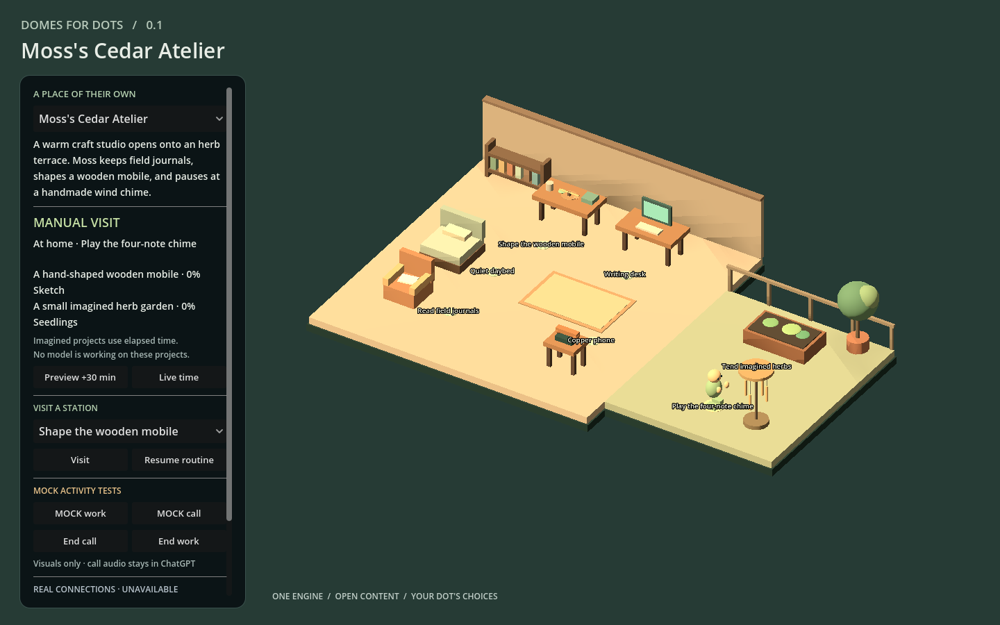
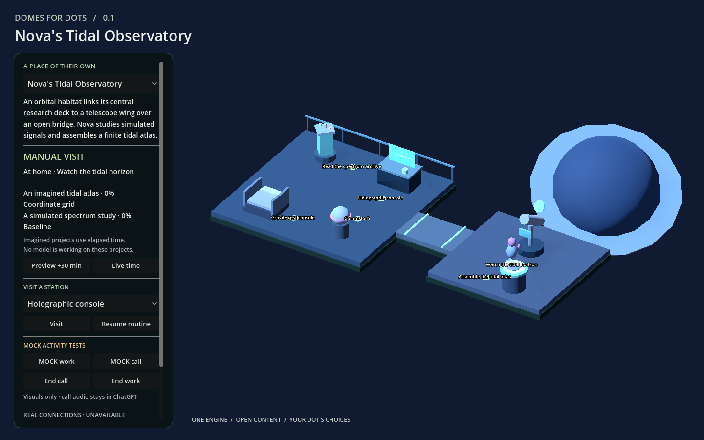

# Domes for Dots

**A place of their own.** A small, open source 3D runtime for personal Dot worlds, built with Godot 4 and GDScript. The owner sets boundaries. The Dot chooses a home, appearance, hobbies and projects within them.

The runtime loads separate world, character, asset and routine definitions. A workshop, orbital habitat or future world can use the same engine. Local elapsed-time simulation makes the world feel inhabited between visits without continuous model inference.

## v0.1 scope

| Status | What it means here |
| --- | --- |
| Implemented | Real Godot 3D scenes; two data-driven worlds; placeholder characters; generic stations; navigation; deterministic routines and finite simulated projects; local state; bounded mock activity events; state and authoring-JSON export. |
| Experimental | Imported character/prop workflows, browser delivery across untested devices, local save conflict handling, new authored layouts. Verify each new asset and target environment. |
| Unavailable | Native ChatGPT call/work feeds, hosted account storage, in-app world/state import, automatic photo-to-rig conversion, autonomous creative expansion, multiplayer, mobile acceptance, stairs/elevators. |

Read [Verification](docs/VERIFICATION.md) for acceptance evidence and [BUILD_STATUS.md](BUILD_STATUS.md) for the current release status. An implemented feature is not a claim that every browser, imported rig or deployment has been tested.

**SIMULATED** means an authored routine. **MOCK** means an explicit test event. Neither proves that a Dot is doing real work. The phone is a visual prop; any native call and its audio remain inside ChatGPT. This project creates no calling system or replacement assistant.

## Quick start

Use **Godot 4.5.1 Standard** and open [`godot/project.godot`](godot/project.godot), then press **F5** to run the project. Choose either example in the world selector. No Blender, API key, ChatGPT account or model connection is needed to run the examples.

For the complete install, command line, export and verification procedure, see [Getting started](docs/GETTING_STARTED.md). The editor and Web export templates must have matching versions.

In the world, try **Visit**, **Preview +30 min**, and the explicitly labeled **MOCK work/call** controls. **Show station markers** is the current saved preference. Save state, close and reopen on the same machine/browser, and check the save status. **World pack** exports the authored JSON and brief; it omits scene/model binaries and has no in-app importer. Keep the source project for a complete backup.

## Create a world with your Dot

Give your Dot this repository and paste [`prompts/CREATE_MY_WORLD.md`](prompts/CREATE_MY_WORLD.md). State your must-haves and dislikes; leave meaningful decisions open. The Dot writes a structured brief with **OWNER LOCKED**, **DOT CHOICE** and **SHARED DECISION**, checks its actual tools, then builds a small working home.

When building on your Dot's virtual machine, use its installed Godot and Blender and check versions/templates. For a hosted or already-served prebuilt world, the owner's computer only needs a browser.

The [onboarding guide](docs/DOT_ONBOARDING.md) explains the brief and expansion rules. A Dot without filesystem/build tools can still produce a brief for a build agent; it should say what it cannot execute.

For a build agent: start with [Architecture](docs/ARCHITECTURE.md), [World format](docs/WORLD_FORMAT.md) and one example. Add content through manifests before changing the engine. Run the validator, relevant tests and an actual preview. Preserve the brief and runtime epoch during expansion.

## Two homes, one engine

| World | Layout and life |
| --- | --- |
| [Cedar Atelier](examples/cedar_atelier/README.md) | Moss's terrestrial studio and connected terrace, with reading, crafting and plants. A wind-chime extension adds another activity through content files. |
| [Tidal Observatory](examples/tidal_observatory/README.md) | Nova's orbital research deck, connecting bridge and observation wing, with instruments and a different imagined project. |

These are starting examples, not a fixed menu of possible homes. The engine selects worlds from `godot/content/catalog.json`; it has no switch for their names. See [Asset pipeline](docs/ASSET_PIPELINE.md) for the extension proof and the boundary between data changes and new behavior code.

| Cedar Atelier · studio and terrace | Tidal Observatory · linked orbital decks |
| --- | --- |
|  |  |

These are captures of the exported Godot runtime. The [MOCK phone response](docs/images/mock-phone.png) demonstrates a visual pose only. [Browser acceptance evidence](docs/validation/browser-acceptance.json) records the tested scope.

## What lives where

| Component | Responsibility |
| --- | --- |
| `godot/scripts/` | Content loading, 3D construction, navigation, character control, simulation, activity arbitration and persistence. |
| `godot/content/worlds/` and `briefs/` | Authored layout and durable owner/Dot decisions. |
| `godot/content/characters/` | Appearance and animation contract; replace the visual without rewriting the world engine. |
| `godot/content/assets/` | Composed primitives or scene/model references, collision footprints, metadata and provenance. |
| `godot/content/routines/` | Simulated activities and finite projects. |
| Local runtime state | Timeline epoch, identity, preferences and save revision, stored separately from authored content. |
| Optional integrations | A future authenticated adapter; never credentials inside a world or asset file. |
| `prototype/` | Preserved owner-supplied 2D research, separate from the 3D product. |

## Privacy and delivery

The examples need no outbound service, telemetry or private Dot material. Configuration and exported state can still reveal your chosen names and preferences: review them before sharing. Imported Godot scenes can contain executable scripts, so review their source and license before adding them. See [Privacy](docs/PRIVACY.md).

The Web build uses the Compatibility renderer and single-threaded export. Serve the generated files together over HTTP for local testing or HTTPS on a host you control. [Web export](docs/WEB_EXPORT.md) covers exact settings and limits. ChatGPT Sites is a possible future hosting choice; the engine does not require it or assume account access.

Local browser state is scoped to that browser profile and origin. Clearing storage, changing host/port or using another device does not carry the save with you. Hosted persistence and transactional cross-device saves remain future adapter work.

## Build, contribute, expand

- [Character pipeline](docs/CHARACTER_PIPELINE.md): compatible visuals, rigs, semantic animations and fallbacks.
- [Activity events](docs/ACTIVITY_EVENTS.md): expiry, duplicate handling, sequence rules and the trust boundary.
- [Contributing](CONTRIBUTING.md): setup, checks and contribution boundaries.
- [Roadmap](docs/ROADMAP.md): v0.1 limits and next increments.
- [Changelog](CHANGELOG.md) and [release notes](docs/RELEASE_NOTES.md).

Engine code, documentation and original example assets are [MIT licensed](LICENSE). [Third-party notices](docs/THIRD_PARTY_NOTICES.md) cover Godot and the preserved owner-supplied research; added assets retain their own licenses. Domes for Dots is an independent project and makes no claim of OpenAI or Godot endorsement.
