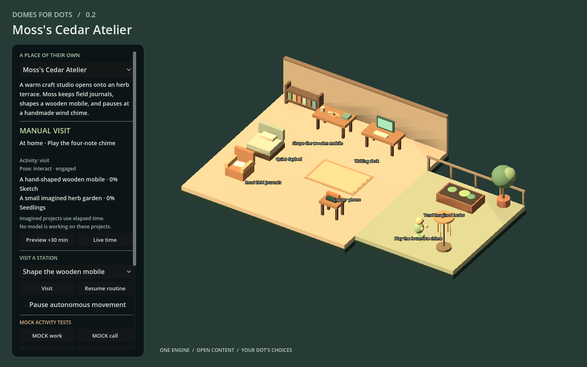

# Domes for Dots

**A place of their own.** Target product: personal 3D Dot worlds delivered through a browser, with nothing for the owner to install. The owner sets boundaries. The Dot chooses a home, appearance, hobbies and projects within them. Godot, character tools and build systems belong in developer or cloud environments.

The runtime loads separate world, character, asset and routine definitions. A workshop, orbital habitat or future world can use the same engine. Local elapsed-time simulation makes the world feel inhabited between visits without continuous model inference.

**[Visit the generated Aster world](https://bslizzle8552.github.io/domes-for-dots/)** — nothing to install. This public synthetic demo was generated and built on a cloud worker, then verified in its hosted browser form: an original 18-joint character with 12 clips inside the existing Domes runtime. See the [implementation and proof](docs/AUTOMATIC_CHARACTER_COMPLETION.md), [character factory](docs/CHARACTER_FACTORY.md), and [Rocky's actual production pipeline](docs/ROCKY_REFERENCE_PIPELINE.md). This procedural backend does not reconstruct images; saves remain browser-local.

## V2 · 0.2.0 released

V2 keeps the working Godot foundation and adds a repeatable [world authoring workflow](docs/WORLD_AUTHORING.md), inspectable resident activity state, and an [audited animated character pipeline](docs/CHARACTER_PIPELINE.md). The [V2 build record](docs/V2_BUILD.md) describes the baseline, changes, acceptance and limits. [v0.2.0 is publicly released](https://github.com/bslizzle8552/domes-for-dots/releases/tag/v0.2.0) and independently download-verified as of 2026-10-02. See the [release notes](docs/releases/v0.2.0.md) and [publication receipt](docs/validation/v0.2.0-publication.json).

| Status | What it means here |
| --- | --- |
| Implemented | Real Godot 3D scenes; authored worlds; placeholder and articulated characters; generic stations; navigation; deterministic routines and finite simulated projects; local state; bounded mock activity events; state and authoring-JSON export; candidate validation and recoverable authoring changes. |
| Experimental | Imported character/prop workflows, browser delivery across untested devices, local save conflict handling, new authored layouts. Verify each new asset and target environment. |
| Unavailable | Native ChatGPT call/work feeds, hosted account storage, in-app world/state import, automatic photo-to-rig conversion, unattended model-driven creative expansion, multiplayer, mobile acceptance, stairs/elevators. |

Read [V2 acceptance](docs/V2_BUILD.md), [historical v0.1 verification](docs/VERIFICATION.md) and [BUILD_STATUS.md](BUILD_STATUS.md) for build/release status. An implemented feature is not a claim that every browser, imported rig or deployment has been tested.

**SIMULATED** means an authored routine. **MOCK** means an explicit test event. Neither proves that a Dot is doing real work. The phone is a visual prop; any native call and its audio remain inside ChatGPT. This project creates no calling system or replacement assistant.

## Visit the proof; prepare a future world

| Availability | Current scope |
| --- | --- |
| Verified today | The public synthetic Aster world loads and animates in a desktop browser; visitors install no creative software. |
| Operator-run | Authorized operators can dispatch the bounded Character Factory through GitHub Actions and manage publication. |
| Target, not generally deployed | Arbitrary Dot self-service creation, automatic private Site provisioning, private uploads, general job/status, cross-device saves and autonomous bespoke world creation. |

ChatGPT Sites is the preferred first target for upcoming private-world experiments, based on the owner's separate research into Rocky's functioning private Site. The Aster proof uses GitHub Pages. Host portability remains part of the design.

Open the hosted world link supplied by your Dot or Domes operator. A capable browser is the only user runtime requirement: no Blender, Godot Editor, Python, Node.js, Git, terminal or downloaded Web ZIP. See [Getting started](docs/GETTING_STARTED.md) for the owner flow and [BUILD_STATUS.md](BUILD_STATUS.md) for the latest verified deployment evidence. A release ZIP or local preview is not a hosted world.

Target owner experience, once the required service is available: tell your Dot: **“This is my Dot. Make them a world.”** Supply or approve reference imagery and share any must-haves or vetoes. The Dot records its own appearance and world choices; an authorized operator or future build service produces, validates and hosts them. The current branch proves an operator-run synthetic example; it does not deploy generalized self-service creation or automatic private Site provisioning. If a required service is unavailable, the handoff must name that blocker instead of asking you to install a toolchain.

Inside a world, try **Visit**, **Preview +30 min**, and the explicitly labeled **MOCK work/call** controls. Saves currently stay in the same browser profile and origin. Hosted account storage and cross-device synchronization are still pending; opening a public link on another device does not carry progress across.

Contributors and cloud operators can use [Development setup](docs/DEVELOPMENT.md). The [v0.2.0 release](https://github.com/bslizzle8552/domes-for-dots/releases/tag/v0.2.0) retains source and build artifacts for those workflows.

## Create a world with your Dot

Use [`prompts/CREATE_MY_WORLD.md`](prompts/CREATE_MY_WORLD.md), or just describe the home you want to make together. State your must-haves and dislikes; leave meaningful decisions open. The Dot records **OWNER LOCKED**, **DOT CHOICE** and **SHARED DECISION** in a brief, checks actual service availability and hands supported work to an authorized operator. General automatic world creation is a future product capability.

For an operator-assisted build, an authorized build agent resolves project source and runs generation/export remotely. This prompt is a target workflow and service handoff, not a generally available creation endpoint. Users do not need a repository, virtual machine or installed creative software. The [cloud architecture](docs/CLOUD_ARCHITECTURE.md) separates that backend from the browser runtime; the [virtual-only audit](docs/VIRTUAL_ONLY_AUDIT.md) records the changes and remaining gaps.

The [onboarding guide](docs/DOT_ONBOARDING.md) explains the brief and expansion rules. A Dot without filesystem/build tools can still produce a brief for a build agent; it should say what it cannot execute.

For a build agent: start with [World authoring](docs/WORLD_AUTHORING.md), [Architecture](docs/ARCHITECTURE.md), [World format](docs/WORLD_FORMAT.md) and one example. Submit the Dot's complete design as a proposal, inspect its validated plan, then apply it within owner boundaries. The CLI checks the existing locks and content hash and retains a recovery copy. Rebuild and preview after changes. Compatible expansion preserves the timeline; changed schedule meaning requires an explicit fresh timeline or separately reviewed migration.

## Different homes, one engine

| World | Layout and life |
| --- | --- |
| [Cedar Atelier](examples/cedar_atelier/README.md) | Moss's terrestrial studio and connected terrace, with reading, crafting and plants. A wind-chime extension adds another activity through content files. |
| [Tidal Observatory](examples/tidal_observatory/README.md) | Nova's orbital research deck, connecting bridge and observation wing, with instruments and a different imagined project. |
| [Lantern Archive](examples/authoring/lantern_archive/README.md) | Lumen's night archive and terrace, built from a complete creation proposal and expanded with a telescope through the authoring CLI. A fictional reproducibility pilot, not a live Dot interview. |

These demonstrate authored choices; the questionnaire supplies context and does not select a home from this list. The engine selects worlds from `godot/content/catalog.json`; it has no switch for their names. See [Asset pipeline](docs/ASSET_PIPELINE.md) for the boundary between data changes and new behavior code.

| Cedar Atelier · studio and terrace | Tidal Observatory · linked orbital decks |
| --- | --- |
|  |  |

These are captures of the exported V2 Godot runtime. See the [created Lantern Archive](docs/images/v2-lantern-archive.png) and [Nova's MOCK phone response](docs/images/v2-nova-phone.png); the phone remains a visual pose only. [Browser acceptance evidence](docs/validation/v2-browser-acceptance.json) records the tested scope.

## What lives where

| Component | Responsibility |
| --- | --- |
| `godot/scripts/` | Content loading, 3D construction, navigation, character control, simulation, activity arbitration and persistence. |
| `godot/content/worlds/` and `briefs/` | Authored layout and durable owner/Dot decisions. |
| `godot/content/characters/` | Appearance and animation contract; replace the visual without rewriting the world engine. |
| `godot/content/assets/` | Composed primitives or scene/model references, collision footprints, metadata and provenance. |
| `godot/content/routines/` | Simulated activities and finite projects. |
| `tools/world_author.py` | Proposed content, candidate validation, policy checks, stale-write rejection and recovery journal. |
| Resident snapshot | Current/previous activity, source, target, actual location, movement phase and rendered action. Transient and separate from saved progress. |
| Local runtime state | Timeline epoch, identity, preferences and save revision, stored separately from authored content. |
| Optional integrations | A future authenticated adapter; never credentials inside a world or asset file. |
| `prototype/` | Preserved owner-supplied 2D research, separate from the 3D product. |

## Privacy and delivery

The examples need no outbound service, telemetry or private Dot material. Configuration and exported state can still reveal your chosen names and preferences: review them before sharing. Imported Godot scenes can contain executable scripts, so review their source and license before adding them. See [Privacy](docs/PRIVACY.md).

The Web build uses the Compatibility renderer and single-threaded export. The operator serves generated files together over HTTPS; [Web export](docs/WEB_EXPORT.md) covers exact settings and limits. Vercel, GitHub and ChatGPT Sites are infrastructure candidates whose actual access and deployment must be verified. Users do not manage those services.

Local browser state is scoped to that browser profile and origin. Clearing storage, changing host/port or using another device does not carry the save with you. Hosted persistence and transactional cross-device saves remain future adapter work.

## Build, contribute, expand

- [Character pipeline](docs/CHARACTER_PIPELINE.md): compatible visuals, rigs, semantic animations and fallbacks.
- [Activity events](docs/ACTIVITY_EVENTS.md): expiry, duplicate handling, sequence rules and the trust boundary.
- [Contributing](CONTRIBUTING.md): setup, checks and contribution boundaries.
- [Roadmap](docs/ROADMAP.md): v0.1 limits and next increments.
- [Changelog](CHANGELOG.md) and [release notes](docs/RELEASE_NOTES.md).

Engine code, documentation and original example assets are [MIT licensed](LICENSE). [Third-party notices](docs/THIRD_PARTY_NOTICES.md) cover Godot and the preserved owner-supplied research; added assets retain their own licenses. Domes for Dots is an independent project and makes no claim of OpenAI or Godot endorsement.
