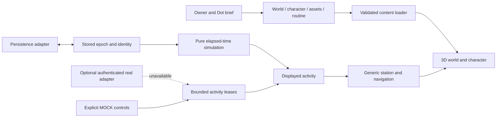

# Architecture

Domes for Dots separates a reusable engine from the place a Dot chooses to inhabit. All current authored formats use `schema_version: 1`. The detailed field contract is in [IMPLEMENTATION_CONTRACT.md](IMPLEMENTATION_CONTRACT.md), with machine-readable definitions in [`schemas/`](../schemas/).

The product boundary is browser-only for owners: see [Cloud architecture](CLOUD_ARCHITECTURE.md) and [Virtual-only audit](VIRTUAL_ONLY_AUDIT.md). The local/native adapters below remain developer and fallback implementations; no owner installs the editor or toolchain. Hosted delivery alone does not implement account storage.

## V2 additions

The [authoring CLI](WORLD_AUTHORING.md) constructs and validates proposed content in isolation, compares owner locks, applies optional machine-readable bounds and records recoverable changes. It changes authored JSON; it does not impersonate a Dot service, generate designs itself, or mutate a resident's saved timeline. Existing scenes and imported models remain reviewed code/resources outside the JSON-only change request.

The resident-state service separates activity intent from rendered animation and observed physical location. Routine boundaries are derived from the original elapsed-time calculation. Optional routine station preferences and tagged work leases select generic activity locations. Source authority, call priority, lease expiry and replay protection remain intact.

Character inspection loads the actual scene and verifies the declared node/clip contract. Nova's original articulated body exercises this path while the procedural character remains supported. Detailed acceptance and limitations are in [V2 build record](V2_BUILD.md).

## Components

The catalog references worlds; worlds reference separate briefs, characters, routines and asset manifests. Full schema and cross-reference checks run in the authoring validator before export; the runtime loader performs narrower checks on bundled local content. It is not an untrusted configuration-import service. The builder instantiates primitive compositions or existing Godot scenes. Asset IDs and activity tags are content strings rather than a central object-type enum.

The character controller owns movement and collision. Its replaceable visual child handles semantic animations. A station supplies activity tags, clear approach and interaction positions, facing, animation and a fallback. The engine chooses a matching station, navigates to its anchors and applies an action; it does not need to know that an object represents a forge, bookcase or musical instrument.

Simulation is a pure calculation of `(routine, epoch, now)`. It counts full cycles plus the final partial cycle and clamps each finite project at completion. It does not increment a project on each frame or viewer connection. Activity leases override the displayed action only; simulation continues independently. An imagined project completing does not produce new model-authored content.

The activity store authenticates source identity through its caller boundary, checks target/sequence/time, expires leases and chooses call before work. The public browser test path trusts MOCK only. There is no native ChatGPT event adapter in v0.1.

The state store exposes `load_state`, `save_state(expected_revision)` and `initial_state`. Native local files and browser local storage are adapters beneath that interface. Remote state requires a future authenticated service with transactional revision checks; changing a JSON connection field must never establish trust.

## Navigation envelope

v0.1 authors connected, flat walkable zones at ground height with stationary collision footprints. The runtime rasterizes their union, removes boundary/obstacle cells for character clearance, builds Godot NavigationMesh polygons and queries paths through NavigationServer3D. A CharacterBody3D follows those paths using collision movement. Unreachable or stalled targets stop with a visible notice. This first contract is deliberately small: visual stairs, floating decks or doors do not imply working traversal.

Future stairs, doors, elevators, portals and zone transitions need explicit links/transition behavior and tests for arrival, interruption and collision. They can extend the navigation service without baking room themes into it.

## Extension and trust boundaries

| Change | Intended mechanism |
| --- | --- |
| Another ordinary prop | Asset manifest and world object reference. |
| Another ordinary activity station | Station anchors/tags/semantic animation plus a routine step. |
| A different layout | Zone and object data, then reachability validation. |
| Another character | Character definition plus compatible scene/rig. |
| New physical effect or interaction capability | Reviewed behavior code with an explicit registration contract. |
| New storage or real reporting transport | Separate adapter with authentication, failure behavior and tests. |

Version 1 has no automatic migration from the historical HTML schema or arbitrary later schema. Keep the last working content/state before upgrades. Reject unknown formats rather than guessing at semantics. See [World format](WORLD_FORMAT.md) and [Privacy](PRIVACY.md).
