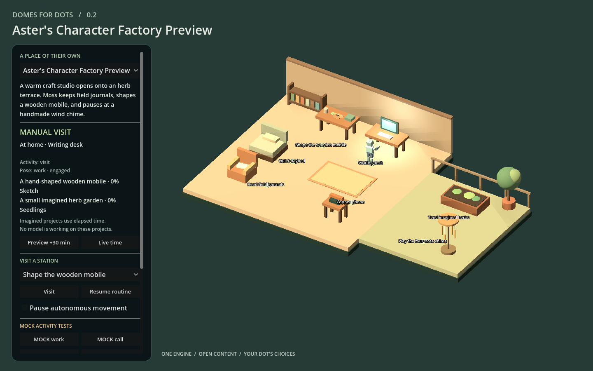

# Automatic characters and virtual-only delivery

Implementation and evidence from 2 October 2026. This is a post-V2 development increment; the published v0.2.0 release and Rocky's existing world remain unchanged.

## What works

[Visit the generated Aster world](https://bslizzle8552.github.io/domes-for-dots/) in a capable browser with nothing to install. The live world passed all nine hosted browser checks and all 16 anonymously downloaded files matched the cloud build's hashes. [Publication and browser evidence](validation/factory-hosted-acceptance.json) records the exact deployed revision.

An approved image-reference envelope and structured Dot/human preferences can now be submitted to a real GitHub-hosted worker. It generates an original segmented character with a real glTF skin, imports it into an isolated copy of Domes, validates actual bone/clip behavior, and exports a complete browser world. A public synthetic Aster specimen exercises this path. Its interview is a test fixture, not a claim that a real Dot independently chose these preferences.

The generator consumes explicit palette, proportions, clothing and accessory choices. Reference pixels are hashed and associated with approved descriptions; this implementation **does not reconstruct a 3D likeness from an image**. The independent [Rocky investigation](ROCKY_REFERENCE_PIPELINE.md) found that his working Blender pipeline also used authored geometry and procedural part motion, with no armature, skin weights or exported clips. No Rocky binary assets were copied or republished.

## Deliverable map

| Requested outcome | Delivered evidence |
| --- | --- |
| Rocky production pipeline map | [Read-only source investigation](ROCKY_REFERENCE_PIPELINE.md) and [binary/source evidence](validation/rocky-reference-evidence.json). Actual .blend/GLB inspection and supported chat consultation, including materials, named parts, scale, +Z forward, activity mapping and absent retargeting. |
| Current V2 local dependency audit | [Virtual-only audit](VIRTUAL_ONLY_AUDIT.md), with exact source/doc/tool paths classified as development, cloud backend, browser runtime or replace. |
| Implemented virtual-only changes | Owner README/onboarding/prompts now lead to conversation and hosted URL; command setup moved to contributor documentation; generated artifact README no longer tells visitors to run Python. Existing Godot runtime is retained. |
| Actual capability inventory | [Capability inventory](CAPABILITY_INVENTORY.md), separating exposed tools, successful read tests, deployed behavior and unavailable integrations. |
| Cloud character architecture | [Cloud architecture](CLOUD_ARCHITECTURE.md): replaceable generator, validated character package, isolated worker, static delivery, separate account/state service. |
| Executable character production | [Factory](../tools/character_factory.py), [GLB backend](../tools/factory_glb.py), [request transport](../tools/character_request.py), [cloud worker](../tools/cloud_worker.py), [real CI workflow](../.github/workflows/character-factory.yml). |
| Standard character package | [Generated cloud package](../examples/character_factory/generated-aster/package.json), [manifest](../examples/character_factory/generated-aster/character.json), [GLB](../examples/character_factory/generated-aster/character.glb), schemas and [factory guide](CHARACTER_FACTORY.md). |
| Dot creative participation | [Conversation prompt](../prompts/character-interview.md), [structured example](../examples/character_factory/aster.interview.json), approval/override/veto processing; unsupported creative intent stays explicit. |
| Automated validation | Schema/identity/digest/GLB/skin/weight/clip checks; source/candidate navigation checks; actual Godot importer and all-clip motion tests. |
| Safe reference proof | Rocky inspected read-only; original Aster fixture used for production/deployment; existing source worlds/characters retained. |
| Browser proof | [Live generated world](https://bslizzle8552.github.io/domes-for-dots/), [hosted acceptance](validation/factory-hosted-acceptance.json), [capture](images/factory-aster-hosted.png) and [local acceptance](validation/factory-local-acceptance.json), with real imported clip/bone telemetry. |
| Future owner documentation | [Getting started](GETTING_STARTED.md), [onboarding](DOT_ONBOARDING.md), creation/expansion prompts. No owner toolchain setup. |
| Tests | Python factory/transport/worker suites plus original V2 suites; Godot skeleton/motion and regression tests; exported-browser navigation/clip/persistence checks. |
| Exact remaining blockers | Below; each is tied to tested boundaries or an absent service, not assumed account capability. |
| Recommended next task | Authenticated submission/status service and durable owner/world/state storage, with two-device acceptance. |

## Verified stages

The [operator dispatch](validation/factory-cloud-build.json) returned a real run identity. [Cloud run 37071571343](https://github.com/bslizzle8552/domes-for-dots/actions/runs/37071571343) completed successfully on source `1446257f788e72407055f3578606d3774a2ecfcb`. Both downloaded artifact archives matched GitHub's SHA-256 digests; all 16 delivered web files matched the worker's hash inventory. The cloud worker receipt keeps build success separate from publication.

- Package: 480 vertices across 20 mesh primitives, one 18-joint rigid skin, twelve authored looping clips, self-contained GLB, ground origin, Y-up, forward -Z, motor-owned translation.
- Semantics: idle, walk, interact, sit, work, read, build, inspect, garden, sleep, talk, phone. Rest/observe/music have explicit fallbacks. These are gestures, not evidence of real Dot work or physical task completion.
- Factory/transport/worker and V2 Python run: 123 discovered, 122 passed, one Windows symlink-privilege skip. The cloud Linux run passed with the two Windows-only case-alias tests skipped. The subsequently added publisher suite separately discovered 16 tests: 15 passed, one Windows symlink-privilege skip.
- Godot: 92 core + 200 runtime + 43 existing character + 59 generated-character checks passed. The runtime suite checked 21,534 physical obstacle samples.
- Local desktop Chromium: nine checks passed, including changing world position **and actual bone poses**, station work, phone and sit clips, same-origin save/reload and no browser/Godot errors. [Engine audit](validation/factory-engine-audit.json) records loaded resources.
- Hosted desktop Chromium: the same nine checks passed in a fresh browser profile at the public HTTPS URL. Pages reported `built`; all 16 files returned HTTP 200 and matching SHA-256 values, with `application/wasm` for the engine. Publication commit: `a40d43059ad08ef1448d4979331500ea7a1ae8a4` on the separate `codex/hosted-character-proof` branch. The first-publication helper verifies both working files and committed bytes before a normal, non-forced push.

The proof reuses Cedar Atelier's layout, stations and descriptive template text; it does not claim automatic generation of a bespoke environment. Rocky's independently inspected segmented-part approach informs the producer/runtime comparison, while Aster provides a safe original specimen with actual skeletal clips. Rocky's assets and private hosted world were not copied, edited or republished.

The initial cloud export exposed a real bootstrap error: threaded templates had been installed for a single-threaded export. The bootstrap now installs the pinned `web_nothreads_*` templates and verifies upstream SHA-512. The succeeding remote run includes this fix. A failed run is not counted as a deployment.

## Remaining blockers and limits

1. **General image-to-3D fidelity:** no callable authorized arbitrary reconstruction/auto-rig service was available. The procedural backend supports a bounded segmented robot vocabulary. New body types, organic deformation and arbitrary retargeting require another producer; the runtime manifest already separates that producer from playback.
2. **Production account service:** no authenticated multi-tenant submission/status endpoint, quota/idempotency store, private upload service or per-owner asset authorization is deployed. The GitHub adapter is operator-only; the public repository is a synthetic demo. Private material requires private infrastructure. The 48 KiB request envelope is deliberately too small for typical full-resolution references.
3. **Cross-device persistence:** the inspected `StateStore` still uses browser localStorage. A hosted URL supplies code/assets, not account synchronization. Remote revisioned saves require an asynchronous adapter and real database transactions.
4. **Vercel deployment:** team/project reads succeeded, but its advertised deploy tool returned “Tool deploy_to_vercel not found.” No usable Vercel deployment credential was found in the checked local environment. A static hosting configuration is ready; no Vercel deployment, auth service or storage provisioning is claimed.
5. **Motion quality and fit:** actual skeletal motion is proven, but prop contact, phone grip, seated furniture alignment, IK, smooth organic weights and likeness acceptance are not. Phone is an empty-hand pose; sleep is a seated doze.
6. **Device coverage:** desktop Chromium is tested. Mobile, Safari, Firefox, touch and real phone/tablet acceptance remain pending.
7. **Native Dot feeds:** no authenticated ChatGPT work/call feed was exposed. Existing SIMULATED/MOCK labels and trust boundaries remain intact.
8. **Publication lifecycle:** the first-publication helper is for this public proof. Production service deployment needs controlled updates/rollback, access checks and durable package retention; CI's temporary artifact retention is not long-term storage.

## Next implementation task

Build the authenticated request/status service around the proven worker and add a durable, revisioned world-state adapter. Acceptance should show two separately signed-in browser sessions visiting the same authorized world, preserving its epoch/progress, rejecting conflicting writes and blocking unauthorized asset/state access. The owner supplies creative input and receives a working URL throughout; no development software is installed on their device.
