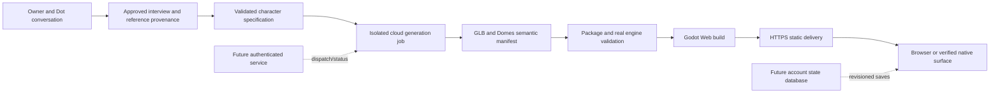

# Cloud character creation and browser delivery

Reviewed 2026-10-02. This is the product boundary and implementation roadmap. [BUILD_STATUS.md](../BUILD_STATUS.md) records actual execution and deployment; a diagram or valid configuration is not evidence of a running service.

## Owner experience

The owner talks with the Dot, supplies or approves reference imagery, reviews material choices, and opens a hosted world. They install no creative or development software. The Dot's interview records self-image, clothing, colors, proportions, accessories, personality, stylization, identifying features and desired activities, alongside human preferences and vetoes. A Dot's name or a supplied image alone does not settle those choices.

Solid generation/build steps describe the executable production boundary; see the completion evidence for which ran remotely. Dashed account services remain pending. No automatic image reconstruction, arbitrary rig retargeting, private-world account system or universal mobile support is implied.

## Keep three systems separate

| System | Contract and responsibility |
| --- | --- |
| Character generator | Receives a validated specification and permitted reference metadata. Produces assets, manifest, provenance and validation evidence. A procedural backend can create an original interpretation; it must not claim to reconstruct reference geometry. Blender, a third-party generator or a future native capability can replace this producer. |
| Standard character package | Stable identity, model/scene resources, dimensions, ground origin, facing axis, rig/player paths, semantic action-to-clip mappings, explicit fallbacks, file hashes and provenance. Missing required actions or broken resources fail validation. |
| Domes runtime | Loads the package's compatible character definition. The shared motor owns locomotion and collision; in-place clips provide visual animation. World/station/routine data uses semantics, not Rocky-specific filenames or bones. |

The existing `schemas/character.schema.json`, `godot/scripts/character_motor.gd` and `godot/scripts/character_audit.gd` remain the runtime contract. Generated GLB data must pass the actual Godot import and loaded-scene audit; glTF syntax validation alone cannot establish node paths, transforms or usable animation. Unsupported `sit`, `sleep`, `garden`, `read`, `build`, `inspect` or `talk` should map through explicit honest fallbacks until a real clip exists.

## Simplest deployment progression

1. **Executable public proof:** an operator submits an approved non-sensitive example to a GitHub Actions worker. The worker creates the package, stages a separate test world, validates it, builds Web assets and publishes or returns the complete artifact. GitHub Pages is a suitable public demonstration host. The owner receives the URL, not GitHub instructions.
2. **Managed creation service:** an authenticated API accepts bounded requests, stores the validated specification durably, dispatches the worker and exposes job status. Private references belong in private object storage, not repository commits or public workflow logs. An account/database service owns access control and transactional progress.
3. **Broader generators:** route the same specification to another capable producer when required. A failed or unsupported generation returns a precise error or an explicitly approved simpler representation; it does not silently claim the requested body was produced.

The source/build repository and shared templates remain operator infrastructure. Avoid a GitHub repository, branch or Vercel project per normal user as the default production model. Prefer one application with stable owner/Dot/world identities and versioned world packages. Separate per-Dot static deployments are useful for a proof or deliberate isolation, but changing preview URLs creates different browser storage origins. A stable canonical world URL is required for current local-save continuity.

## Vercel findings

Vercel can deliver a prebuilt static Godot export and route API requests. Its Build Output API describes deployable static/function output; the worker can hand off prebuilt assets without installing Godot on the owner's device. Deployment creation and a successful browser fetch must still be verified with the selected account. [Build Output API](https://vercel.com/docs/build-output-api).

Use short API handlers for authorization, job submission/status and version lookup. Heavy generation/import/export belongs in an isolated worker with explicit deadlines and persisted job state. This is an architecture choice based on the workload, not a claim that Vercel cannot execute binaries. Current Fluid limits include 300 seconds on Hobby; Pro/Enterprise support 800 seconds generally and 1,800 seconds in a runtime-dependent beta. Memory caps are 2/4 GB. Large-function beta permits 5 GB bundles in eligible configurations; standard Node/Python limits differ. HTTP function payloads are limited to 4.5 MB, so large references/models need direct authorized object-storage transfer. Recheck account/runtime eligibility before provisioning. [Function limits](https://vercel.com/docs/functions/limitations).

Vercel Blob can hold generated files and private references. A transactional database through Marketplace can hold owners, worlds, job state and save revisions; runtime configuration storage is not a substitute for save transactions. Provisioning, credentials, budget, retention and deletion controls are service work, not established by installing the Vercel plugin. [Storage overview](https://vercel.com/docs/storage).

Vercel deployment protection can control access to selected deployments; it does not implement the Domes owner/world authorization model by itself. Both the packed world assets and state APIs must enforce the chosen privacy model. [Deployment protection](https://vercel.com/docs/deployment-protection).

In this run, account/team/project read access was verified by the coordinating agent. The exposed deployment tool returned `MCP tool not found`; read access is therefore not a completed Vercel deployment route. No Vercel deployment or storage provisioning is claimed here. The final run evidence is authoritative if capability status later changes.

## GitHub findings

GitHub is suitable for reviewed engine source, reusable world examples, package versions, CI validation, build triggers and release artifacts. GitHub-hosted Actions jobs can run for up to six hours; plan-dependent concurrency, artifact storage and usage quotas still apply. Actions is a practical initial worker for trusted project jobs, not a complete user-facing job service or durable state database. [Actions limits](https://docs.github.com/en/actions/reference/limits).

A future frontend should dispatch using a server-held GitHub App credential or equivalent scoped service identity, never ask owners for personal access tokens. Dispatch only validated input; do not interpolate user text into shell commands, accept arbitrary workflow paths or execute unreviewed uploaded scenes. Store package hashes and the source revision with each job. Keep durable packages in managed storage; temporary CI artifacts alone are not a lifetime backup.

GitHub Pages supports the public static proof, with a 1 GB site limit and soft bandwidth quota. It is not the private account backend and must not be presented as the commercial SaaS hosting plan. GitHub documents restrictions on commercial SaaS and sensitive transactions. [Pages limits](https://docs.github.com/en/pages/getting-started-with-github-pages/github-pages-limits).

## Pending service interfaces

These are proposed API contracts, not endpoints currently implemented by the Godot runtime:

| Interface | Required behavior |
| --- | --- |
| `POST /character-jobs` | Authenticate owner; validate specification, referenced upload rights and quotas; persist an idempotency key and job before dispatch. Return job identity without waiting for a 3D build. |
| `GET /character-jobs/{id}` | Enforce ownership. Return queued/running/failed/validated/published with stage-specific evidence; publication needs a verified URL. |
| `GET /worlds/{id}` | Authorize access and return the approved package version and stable visit URL. |
| `GET/PUT /worlds/{id}/state` | Authenticate and use an atomic expected-revision transaction. Preserve the current epoch/identity semantics; a conflict must not overwrite newer progress. |

An HTTP adapter must be asynchronous. The current `StateStore` uses synchronous local storage/file methods, so wiring a URL into configuration cannot add remote persistence. Introduce explicit loading/saving/error states and await the server response; test concurrent clients, expired authentication, offline operation and interrupted saves. Keep local state available as a clearly labeled fallback until migration succeeds.

## Next implementation task

Build the authenticated submission/status service and durable owner/world/state store around the proven worker. Acceptance: two separate browsers access the same authorized world and preserve its epoch/revision; concurrent writes produce a conflict rather than loss; an unauthorized browser cannot fetch private packs or state; a submitted reference/specification returns a verified character-containing URL without owner-installed tools. Reference-to-mesh reconstruction and wider body types remain a distinct generator capability task.
