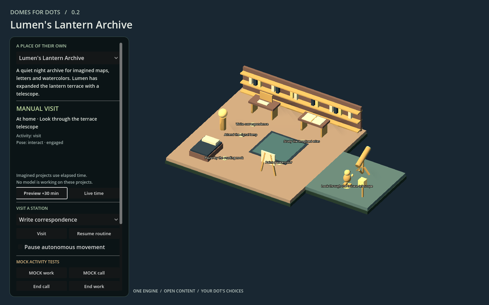
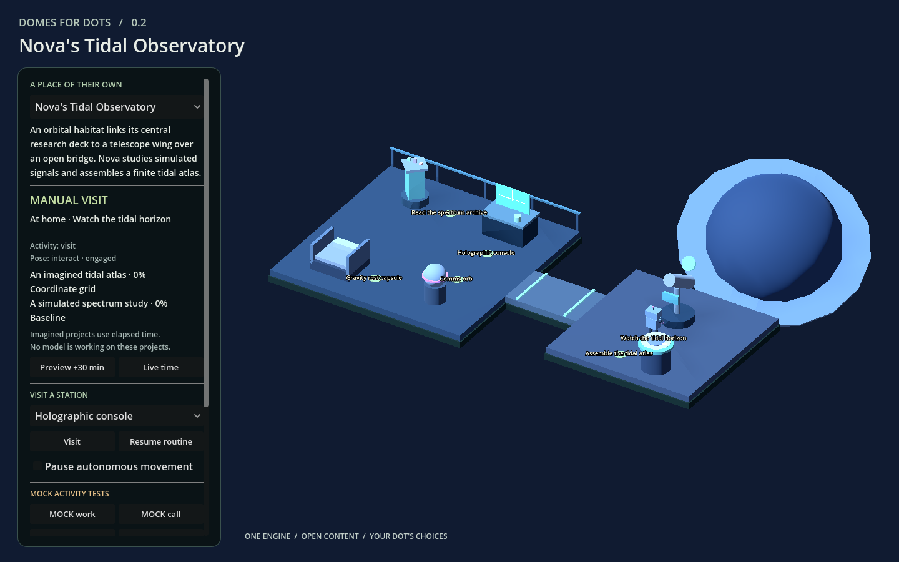

# V2 build record

V2 continues the released Godot project as version **0.2.0**. It keeps the catalog, separate JSON documents, generic interaction stations, navigation, character motor, deterministic simulation, and local state adapters. Schema version 1 remains compatible; optional fields extend existing contracts.

## Baseline established before changes

On 2026-10-02, source commit `c322769312df18659387329c538fe864d22c03ad` was inspected and built with the repository's installed Godot 4.5.1 and matching Web templates. The unmodified application passed:

- 46 Python tests, 71 Godot core assertions and 108 runtime assertions.
- Real physics visits to every existing station and 13,956 obstacle-clearance samples.
- All 26 exported-browser acceptance checks in an isolated Chrome profile.
- Visual inspection of the rendered Cedar Atelier and Tidal Observatory.

Baseline build and browser evidence is retained locally under `artifacts/v2-baseline/`. The existing browser acceptance tool was used because `agent-browser` was not installed. The provided V2 request ends mid-sentence in section 7; this implementation follows the received requirements.

## What the audit found

Creation and expansion were documented but required manual file edits. Owner locks were preserved by convention; their values were not compared against a proposed change. Routine state exposed a target station and animation without distinguishing physical arrival from activity intent. Both residents used one procedural visual with different colors. The imported-scene contract had a useful test fixture but no scene audit tool or production animated replacement.

Existing simulation and event handling were substantive, not placeholders: deterministic finite project progress, bounded mock leases, call priority, expiry/replay checks, save conflicts and backup recovery all ran successfully. Native ChatGPT event reporting was and remains unavailable. Asset-level anchors and behavior strings are descriptive; executable effects require reviewed station behavior code.

## V2 choices

**World authoring:** accept a complete authored proposal rather than a questionnaire-to-template mapping. Validate a candidate, compare owner locks, enforce optional budgets and operation policy, reject stale bases, preserve originals and record changes. A model or build agent still makes the creative decisions and edits the documents.

**Resident state:** expose the current and previous activity, source, start/boundary times, target object, physical location, arrival and animation separately. Transient events remain separate from persistent timeline state. A pause control governs autonomous movement; simulated elapsed-time project accounting remains independent.

**Character pipeline:** retain the inexpensive placeholder and add an original articulated visual with actual AnimationPlayer clips. Audit scenes and their declared clips using Godot. A photo can guide design; arbitrary image reconstruction and automatic rig retargeting remain outside the delivered pipeline.

**Creation pilot:** author a third fictional home from a complete brief, build it using the new tool, and add a telescope through a subsequent request. This exercises reproducibility mechanically. It is not an independent owner study or a claim that a live ChatGPT Dot chose the design.

## Final verification · 2026-10-02

**PASS for the scope below.** The 0.2.0 Web export is `dist/web/`, served locally at [127.0.0.1:8060](http://127.0.0.1:8060). Release validation was rerun from clean source commit `a2786137c82d75fb04ff120dc8d46b8e3d088a53`; the manifest records `source_dirty: false` and the SHA-256 of all 59 runtime source files. The release tag and package receipt identify the subsequent documentation/evidence commit, whose runtime hashes are unchanged. The prepared release was subsequently [published on 2026-10-02](https://github.com/bslizzle8552/domes-for-dots/releases/tag/v0.2.0); all four assets were independently downloaded without authentication and matched by SHA-256. See the [publication receipt](validation/v0.2.0-publication.json). No public world hosting was created. Historical v0.1 evidence remains unchanged.

| Check | Final result |
| --- | --- |
| Content validation | All three catalog worlds, references, schema contracts, routine preferences and conservative planar navigation pass. |
| Python | 70 tests pass, including 22 authoring failure/constraint/recovery cases and the complete creation/expansion/recovery pilot. |
| Godot core | 92 assertions pass: simulation, activity leases, resident state and persistence. |
| Godot runtime | 200 assertions pass; all 121 station pairs resolve; all 19 stations are physically visited, plus return legs; 21,534 clearance samples pass. |
| Character tests | 43 assertions pass: actual clip/joint movement, transitions, floor clearance, fallback and invalid rig detection, and same-motor traversal. |
| Loaded character audit | All three character definitions pass. The two procedural profiles and Nova's joint rig are distinguished explicitly; no skeletal retargeting claim. |
| Exported browser | 37 checks pass in Chrome 154.0.8037.97 on Windows, WebGL 2 Compatibility renderer, with no JavaScript or Godot errors. |
| Browser scope | Three worlds; custom activity routing and arrival; previous/source state; pause save/reload; no mock replay; call/work priority and expiry; forged-source rejection; revision conflict; storage failure/backup recovery; JSON exports; actual pointer input; Nova work/rest/phone; telescope traversal. |
| Visual review | All three worlds inspected. Corrected hidden archive books and an offset telescope lens, rebuilt and reinspected. Nova's distinct body and standing rest/work/phone poses are visible; prop grip and seating are not claimed. |
| Startup regression | Fixed an intermittent query before the navigation map's first synchronization. Final build plus three additional 200-check runtime runs pass without engine errors. |
| Source/handoff | Local Markdown links resolve; whitespace and source hygiene checks pass. Prototype files remain unchanged. Creation/expansion preserved every preexisting content file byte-for-byte. |

Evidence: [build manifest](validation/v2-build-manifest.json), [browser checks](validation/v2-browser-acceptance.json), [character inventory](validation/v2-character-audit.json), and [actual authoring receipts](validation/v2-authoring-receipts.json). Clean release build logs are under `artifacts/build/20261002T142722Z-33eaca69/`; earlier startup repetitions are `artifacts/runtime-startup-repeat-*.log`.

The creation and telescope requests were applied through the public CLI. Visual polish was a third compatible asset-only request, recorded in Lumen's brief. The starter proposals now contain the corrected geometry so a new creator starts from the validated result. The creation pilot is fictional; an independent owner/Dot usability trial remains unperformed.

| Lumen's created and expanded archive | Nova's articulated body in the original world |
| --- | --- |
|  |  |

Additional pose captures: [work](images/v2-nova-work.png), [standing rest](images/v2-nova-rest.png), [visual phone response](images/v2-nova-phone.png).

## Release preparation

All intended V2 source, schemas, examples, Godot UID sidecars, documentation, screenshots and sanitized evidence are tracked. The release hygiene scan covers 146 files. Existing ignore rules correctly exclude caches, toolchains, generated exports, local state and credentials; no unintended nonignored artifacts required deletion. Working text was normalized to the existing LF policy before the clean build, so packaged source bytes match Git. The supplied prototype remains unchanged.

The clean packaging command is `python tools/package_release.py`. Its four upload assets are under `dist/release/`; the package receipt identifies the source commit and `SHA256SUMS` identifies both ZIPs. Final archive verification and the source-archive rebuild passed before tagging. The [publication handoff](RELEASE_PREPARATION.md) was completed: the prepared history/tag were pushed, both GitHub CI runs passed, the [prepared release body](releases/v0.2.0.md) was published with exactly four assets, and anonymous download verification passed. No additional product changes are part of this release preparation.

## Reproduce and use

Run `python tools/build.py` with the pinned Godot installation and matching templates; this validates content, runs Python and all three Godot suites, audits characters and exports Web. Run `python tools/serve.py --port 8060`, then `node tools/browser_acceptance.cjs` with Playwright and Chrome available. The browser test uses an isolated profile; it does not alter the owner's browser saves.

Give a Dot the repository and [CREATE_MY_WORLD](../prompts/CREATE_MY_WORLD.md). It authors its own brief, layout, assets, representation and routine within owner boundaries. [World authoring](WORLD_AUTHORING.md) documents create/prepare, plan, apply and recover; [the pilot](../examples/authoring/lantern_archive/README.md) provides complete runnable example inputs. Launch the current build and choose **Lumen's Lantern Archive** to inspect the telescope addition, or **Nova's Tidal Observatory** for the new articulated body. Scroll the sidebar to find custom MOCK activity and save/export controls.

## Remaining limits

The runtime still uses flat connected floors and local saves. Civil-time schedules, weighted routines, automatic model-driven background expansion, native ChatGPT call/work adapters, hosted synchronization, browser world imports, arbitrary photo-to-3D and universal imported-rig compatibility are not provided. New content requires validation and a rebuild. A body or model must be reviewed and visually tested before acceptance. Content-policy checks are local guardrails, not a sandbox or authentication system for an agent with filesystem access.

Compatible edits retain save meaning. A different schedule or project integration requires a deliberately fresh world/routine identity; no general progress migration is included. Policy budgets count authored JSON, objects and parts; imported binaries and measured GPU performance need separate review. Browser saves remain scoped to an origin/profile, and simultaneous writers are not a guaranteed atomic transaction. Mobile, Safari, Firefox, Blender-authored rigs and an independent owner pilot remain untested.
